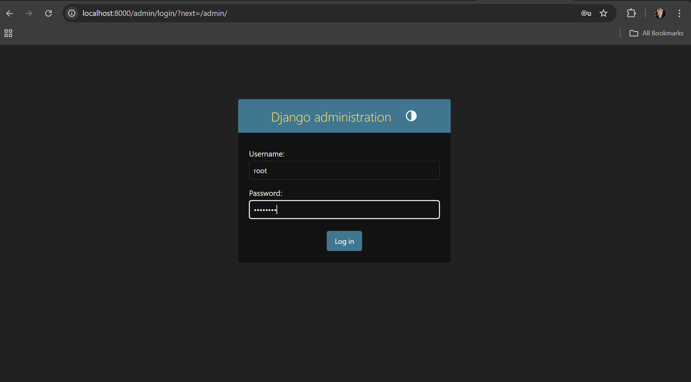
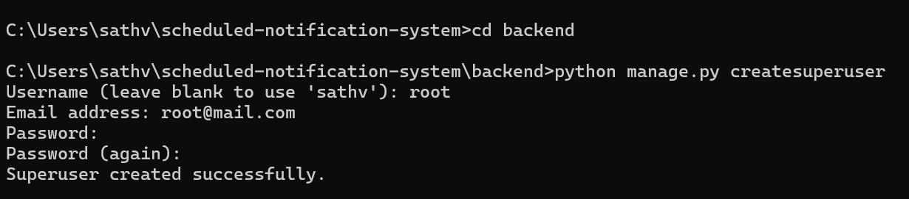
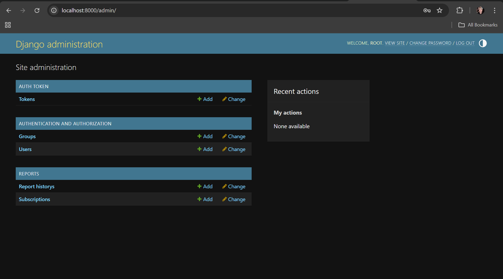
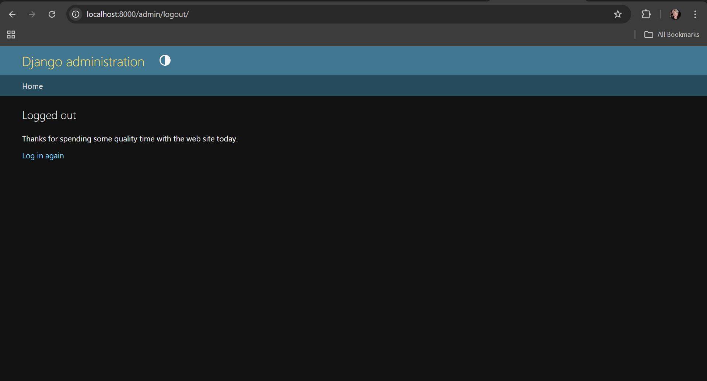
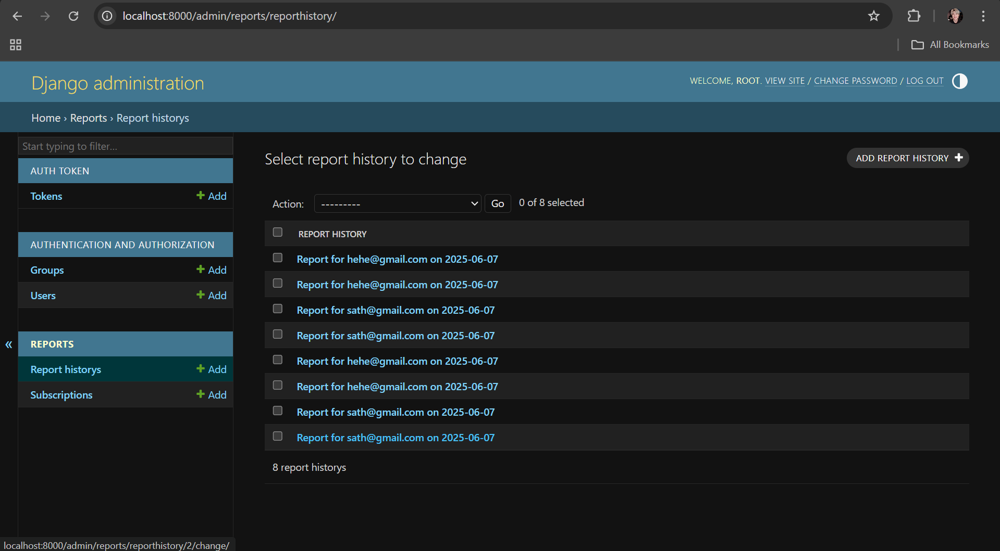
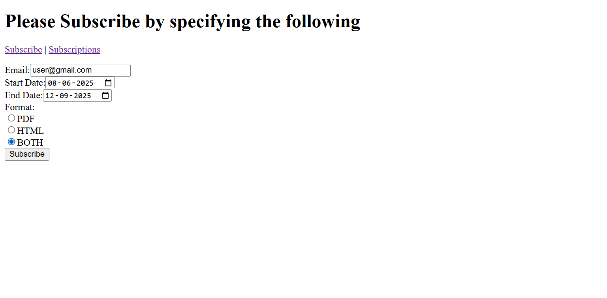
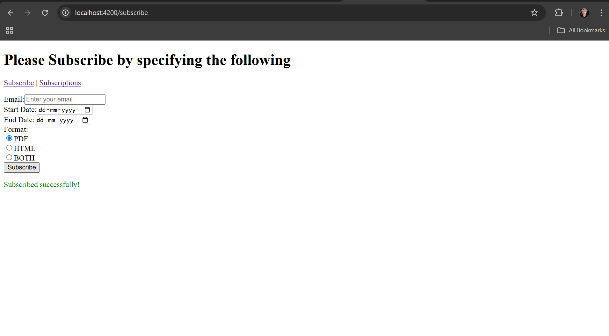
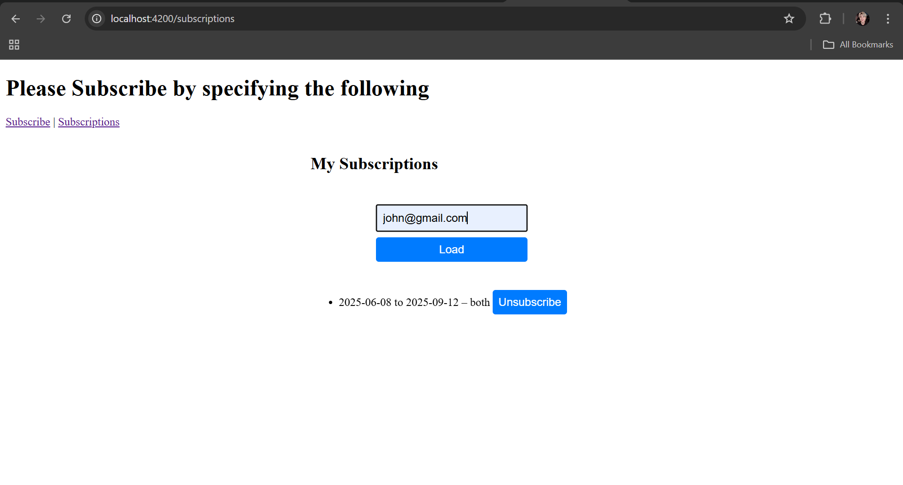
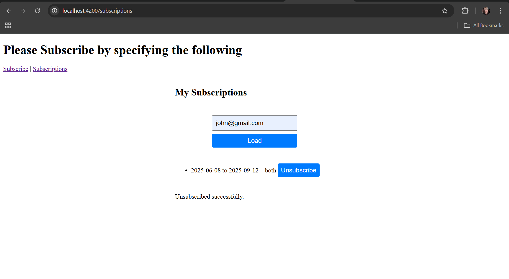
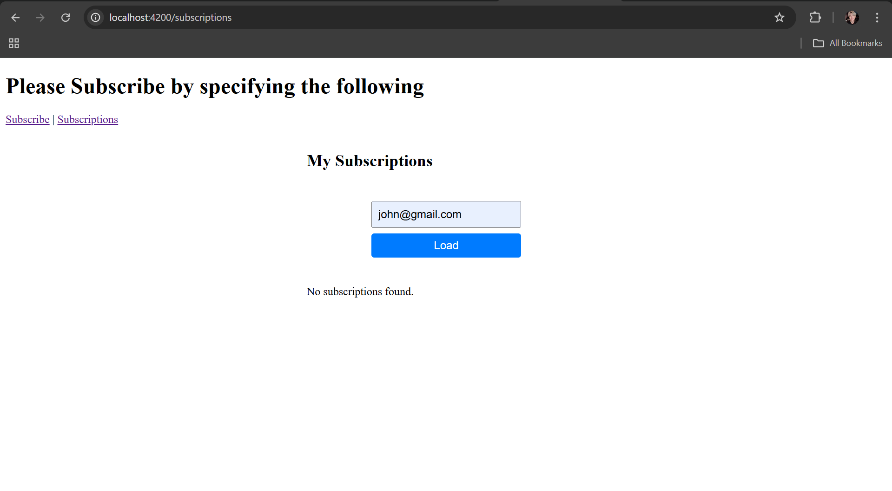

# 📩 Scheduled Notification System

A comprehensive full-stack application that empowers users to **subscribe to automated daily reports** delivered directly to their inbox. Built with Django REST Framework and Angular, this system provides flexible report formatting (PDF, HTML, or both), intelligent scheduling, and robust administrative controls.

---

## 🚀 Features

This notification system offers a complete suite of features designed for both end-users and administrators:

- ✅ **Email-based Authentication** - Secure user registration and login system with email verification
- 📅 **Flexible Scheduling** - Subscribe to daily reports with customizable start and end dates
- 📄 **Multi-format Reports** - Choose between PDF, HTML, or both formats based on your preference
- 📬 **Automated Delivery** - Smart email delivery system that respects subscription schedules and preferences
- ❌ **Easy Unsubscription** - One-click unsubscribe functionality accessible from the frontend
- 🔒 **Powerful Admin Panel** - Complete Django admin interface for subscription management and monitoring
- 📊 **Usage Analytics** - Track subscription patterns and format preferences through the admin dashboard

The system is designed to handle enterprise-scale operations while maintaining simplicity for individual users.

---

## 🧱 Project Architecture

The application follows a clean separation of concerns with a Django backend API and Angular frontend:

```plaintext
scheduled-notification-system/
│
├── backend/                          # Django REST API
│   ├── manage.py                     # Django management script
│   ├── scheduled_notifications/      # Main Django project
│   │   ├── settings.py              # Configuration and environment settings
│   │   ├── urls.py                  # Root URL routing
│   │   └── wsgi.py                  # WSGI application entry point
│   └── subscriptions/               # Core subscription app
│       ├── models.py                # Database models and relationships
│       ├── views.py                 # API views and business logic
│       ├── api_urls.py              # API endpoint definitions
│       ├── management/              # Custom Django commands
│       │   └── commands/
│       │       └── send_reports.py  # Automated report delivery command
│       └── templates/               # Email and report templates
│           └── reports/
│               └── report_template.html
│
├── frontend/                        # Angular application
    ├── src/
    │   ├── app/
    │   │   ├── components/          # Reusable UI components
    │   │   │   ├── header/          # Navigation and branding
    │   │   │   ├── subscription-form/  # Subscription management
    │   │   │   └── subscriptions-list/ # User subscription dashboard
    │   │   └── app.routes.ts        # Frontend routing configuration
    │   └── main.ts                  # Angular bootstrap
```

This architecture ensures scalability, maintainability, and clear separation between frontend presentation and backend business logic.

---

## ⚙️ Setup Instructions

### 🐍 Backend (Django)

The Django backend provides the API endpoints, database management, and report generation capabilities:

```bash
cd backend
python -m venv venv
source venv/bin/activate # or venv\Scripts\activate on Windows
pip install -r requirements.txt
python manage.py migrate
python manage.py runserver
```

**Additional Setup Steps:**
- Configure your email settings in `settings.py` for SMTP delivery
- Create a superuser account for admin access: `python manage.py createsuperuser`
- Ensure your database is properly migrated and all dependencies are installed
- The backend will run on `http://localhost:8000` by default

### 🖥️ Frontend (Angular)

The Angular frontend provides a modern, responsive user interface with real-time updates:

```bash
cd frontend
npm install
ng serve
```

**Development Notes:**
- The frontend will be available at `http://localhost:4200`
- Ensure CORS settings are properly configured in Django settings
- The application uses standalone components for better performance and reduced bundle size
- All API calls are configured to work with the Django backend automatically

---

## 📬 Sending Reports

The system includes a sophisticated report delivery mechanism built as a custom Django management command:

```bash
python manage.py send_reports
```

**Report Delivery Logic:**
- Only processes subscriptions where `is_active=True` and the current date falls within the subscription period
- Respects user format preferences (PDF, HTML, or both) for personalized delivery
- Includes comprehensive error handling and logging for failed deliveries
- Reports are generated dynamically with current data and formatted professionally

**Report Content Features:**
- **PDF Reports**: Generated using `reportlab` with custom styling, charts, and professional formatting
- **HTML Reports**: Rendered via Django templates with responsive design and interactive elements
- **Data Integration**: Pulls real-time data for accurate, up-to-date reporting
- **Customization**: Easy to extend with additional report types or data sources

---

## 📊 UX and Creativity: Report Generation

The report generation system is designed with both functionality and user experience in mind:

| Tool | Usage | Benefits |
|------|-------|----------|
| 📄 **ReportLab** | PDF generation with custom layouts | Professional documents, consistent formatting, print-ready output |
| 🌐 **Django Templates** | HTML report rendering | Interactive content, responsive design, web-optimized viewing |
| 📈 **Plotly/Chart.js** | Data visualization (optional) | Dynamic charts, interactive graphs, enhanced data comprehension |

**Design Philosophy:**
- **Readability First**: Clean layouts with proper typography and spacing
- **User Choice**: Multiple format options to suit different use cases
- **Extensibility**: Modular design allows easy addition of new report types
- **Performance**: Optimized generation process with caching and efficient queries

The system ensures that whether users prefer PDF documents for archival purposes or HTML reports for interactive viewing, they receive high-quality, professionally formatted content.

---

## 🛡️ Admin Panel

Django's admin interface has been customized to provide comprehensive subscription management capabilities for administrators and support staff.

### 🔐 Accessing Admin Panel

1. **Start the backend server:**
   ```bash
   python manage.py runserver
   ```

2. **Navigate to:** `http://localhost:8000/admin/`

3. **Login** using your superuser credentials created during setup
   
   
4. **Send Reports** The admin can send reports to all the active subscriptions using the following command
   ```bash
   python manage.py send_reports
   ```
   This command will send emails to all the active users and these sent email logs are stored in the `/backend/sent_mails` directory.
   

### 🧑‍💼 Admin Features

The admin panel provides extensive functionality for managing the notification system:

| Feature | Description | Use Case |
|---------|-------------|----------|
| 🔍 **View Subscriptions** | Filter by email, dates, status, and format preferences | Monitor active subscriptions and user engagement |
| 📝 **Edit Subscriptions** | Modify dates, formats, or activation status | Handle user requests and troubleshoot issues |
| ❌ **Delete Subscriptions** | Remove expired or incorrect entries | Maintain database cleanliness and handle cancellations |
| ➕ **Add Subscriptions** | Manually create subscriptions via admin form | Support assisted signup and bulk operations |
| 📊 **Monitor Activity** | Analytics on format preferences and usage patterns | Business intelligence and system optimization |
| 🔍 **Advanced Filtering** | Search and filter by multiple criteria | Efficient management of large user bases |

**Additional Admin Capabilities:**
- Bulk actions for managing multiple subscriptions simultaneously
- Export functionality for reporting and analysis
- User activity tracking and subscription history
- System health monitoring and error reporting

### 🛠️ Create Superuser

To access the admin panel, you'll need administrative privileges:

```bash
python manage.py createsuperuser
```

Follow the interactive prompts to set up your admin account, then login at `/admin/` to access the full management interface.

---

## 📷 Screenshots

Visual documentation of the admin interface and key features:

### 1. Creation of the super user


### 2. Super user Login


### 3. Representation of the Admin Dashboard


### 4. Super User Logout


### 5. Admin Viewing the Report History



---

## 📮 API Endpoints

The REST API provides comprehensive functionality for frontend integration and third-party access:

| Endpoint | Method | Description | 
|----------|--------|-------------|
| `/api/subscribe/` | POST | Create new subscription with preferences | 
| `/api/unsubscribe/` | POST | Cancel subscription using email | 
| `/api/subscriptions/` | GET | List user's active subscriptions |


### 1. The Subscription Form at `/subscribe`


### 2. Subscription with preferred Format Successful


### 3. List of subscriptions for the given email-id


### 4. Unsubscribe this email for the Service


### 5. Successful Unsubscribe for this user



**API Features:**
- **RESTful Design**: Consistent, predictable endpoints following REST principles
- **Token Authentication**: Secure JWT-based authentication for protected endpoints
- **Comprehensive Error Handling**: Detailed error messages and appropriate HTTP status codes
- **Rate Limiting**: Built-in protection against abuse and excessive requests
- **Documentation**: Auto-generated API documentation available at `/api/docs/`

---

## 📌 Technical Notes

### **Frontend Architecture**
- **Angular Framework**: Modern TypeScript-based frontend with reactive programming
- **Standalone Components**: Reduced bundle size and improved performance through standalone architecture
- **Responsive Design**: Mobile-first approach ensuring compatibility across all devices
- **State Management**: Efficient data flow and state synchronization with backend

### **Backend Architecture**
- **Django REST Framework**: Robust API development with built-in authentication and serialization
- **Custom Management Commands**: Automated report delivery through Django's command system
- **Database Optimization**: Efficient queries and indexing for scalable performance
- **Email Integration**: SMTP configuration for reliable email delivery

### **Configuration Requirements**
- **CORS Settings**: Properly configured cross-origin resource sharing for frontend-backend communication
- **Environment Variables**: Secure configuration management for sensitive data
- **Database Setup**: PostgreSQL recommended for production, SQLite suitable for development
- **Email Configuration**: SMTP settings required for email delivery functionality

### **Deployment Considerations**
- **Production Settings**: Separate configuration files for development and production environments
- **Static File Handling**: Configured for serving static assets in production
- **Security**: HTTPS enforcement, secure headers, and proper authentication handling
- **Monitoring**: Logging configuration for tracking system performance and errors

This system is designed to scale from small personal use to enterprise-level deployments while maintaining security, performance, and user experience standards.
